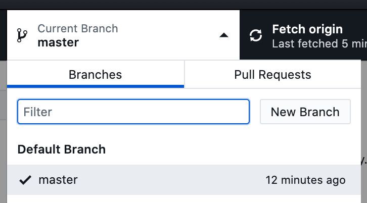
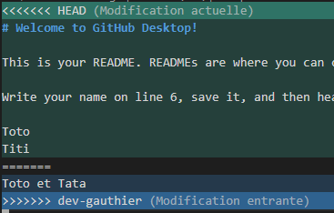
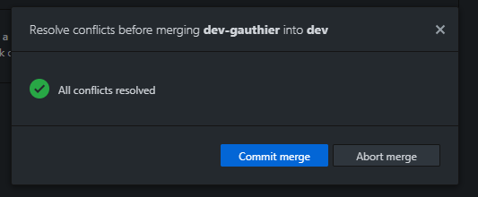

# Labs - Introduction to Git

## Objectives

This workshop can be done **in groups of 2/3 people**.

1. Perform the Github Desktop Tutorial
2. Create a repository and clone it on your computer
3. Create a branch and navigate between branches
4. Modify a file in the repository and push the modifications
5. Manage conflicts

## Before starting

1. Create a Github account: https://github.com/
2. Install Github Desktop from this url: https://desktop.github.com/
3. Install an IDE or text editor (ex: https://code.visualstudio.com/ or https://atom.io/)

## 1. Perform the Github Desktop Tutorial

1. Launch Github Desktop
2. Start the Github Desktop Tutorial by clicking "Create a Tutorial Repository ..." and follow the instructions

## 2. Create a repository and clone it on your computer

**A single member** of the group creates a repository:

1. Log in to [Github.com](https://github.com/)
2. Navigate to the **"Your repositories"** page
3. Click on **"New"**
  - Choose a name
  - Chose the **"Public"** option
  - Check the box **"Add a README file"**
  - Check the box **"Add .gitignore"** with the **"Node"** template
4. Navigate to the created repository, then to the **Settings → Manage Access** page
5. Click on **"Invite a collaborator"** and add the other members of your group

**All group members** clone the repository:

6. Open Github Desktop
7. Click on **"Clone a repository from the Internet"**
8. **GitHub.com** → Filter your repositories
10. Click on “Clone”

You now have a copy of the local repository

## 3. Create a branch and navigate between branches

**A single member** of the group creates the `develop` branch:

1. In Github Desktop: **Current branch → New branch**

2. Choose the name of the branch (`develop`) and **"Create branch"**

You can now navigate (= checkout) between the master and develop branches.

## 4. Modify a file in the repository and push the modifications

**A single member** of the group modifies the **"README.md"** file and pushes to the `develop` branch:

1. Modify the **"README.md"** file entirely:
  - Open the repository in your IDE
  - Replace the entire contents of the **"README.md"** file
2. In Github Desktop:
  - Choose a commit message ("Summary")
  - Click on **"Commit to develop"**
  - Use **"Publish branch"** to push your changes to the remote repository
  
**The other members** of the group get the changes:

3. Use **"Fetch origin"** to synchronize your local repository with remote changes
4. Navigate to the develop branch and watch your files change in your IDE

## 5. Manage conflicts

A conflict occurs when a part of a file has been modified on 2 branches which must be merged (**merge**). We will create a conflict to see how to resolve it.

Both **2 members** of the group create a branch from `develop` and modify the same part (same lines) of the **README.md** file:

1. Create a branch `dev-firstname` **"based on ... develop"**
2. Edit the **README.md** file
3. Commit changes
4. Push your changes

Alternately, each member merges the new branches into `develop`:

5. Checkout the `develop` branch
6. Click on **"Merge into current branch ..."**
7. Select branch
8. Push your changes
9. **The 2nd member** of the group will encounter a conflict:
  - Open your IDE as suggested by Github Desktop
  - The conflict materialize as follows:
  
  

  - To resolve the conflict, keep either the `HEAD` part, or the `dev-firstname` part and delete the other lines (including the `====` and `>>>>` lines)
  - Once the lines are deleted you can commit the merge from Github Desktop:

  

## 6. Redo the lab using command line interface (CLI)

The goal is to redo the same actions as before with the command line.
For this you must have a terminal and GIT installed by default on Linux or MacOS.

For the installation:
- Windows: https://gitforwindows.org/
- Linux: https://git-scm.com/download/linux
- MacOS: https://git-scm.com/download/mac

You can now open Terminal (on Linux or MacOS) or Git Bash (on Windows).

You can find a detailed list of the different GIT CLI commands:
- https://gist.github.com/aquelito/8596717
- https://github.github.com/training-kit/downloads/github-git-cheat-sheet.pdf

## Bonus tasks

1. Add multiple remotes ([reference here](https://git-scm.com/book/en/v2/Git-Basics-Working-with-Remotes))
2. Squashing commits (reference [here](https://git-scm.com/book/en/v2/Git-Tools-Rewriting-History) and [here](https://stackoverflow.com/questions/5189560/squash-my-last-x-commits-together-using-git))
3. Reverting history (reference [here](https://gist.github.com/gunjanpatel/18f9e4d1eb609597c50c2118e416e6a6) and [here](https://stackoverflow.com/questions/1270514/undoing-a-git-push))
4. Rebasing (reference [here](https://git-scm.com/book/en/v2/Git-Branching-Rebasing))
Cherry-picking 
