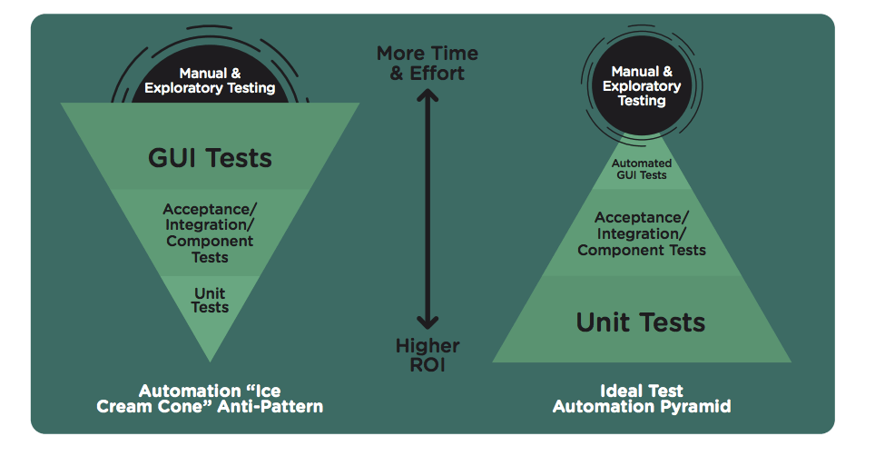

# Continuous testing

## Benefits

- Better efficiency and higher-quality deployments
- Rapid error discovery and remediation for distributed projects
- Improved user experience
- Minimization or elimination of business disruption and its costs

[Read more](https://www.ibm.com/cloud/learn/continuous-testing)

## Types of tests

**Unit tests:**

- Lowest level of testing
- Test an individual unit (or function) of a software
- Tests are run in very controlled environment
- 90-100% test coverage

**Functional:**

- Higher level function testing
- Test outside dependencies
- Example: get a specific value from a database, API

**Integration:**

- Assemble project modules
- Test how microservices work together
- Example: database connection

**End-To-End:**

- Test the application in a real environment
- Use production-like database
- UI testing
- Acceptance testing

## Example

## Test coverage

## Test driven development (TDD)

## TDD benefits

- Better program design and higher code quality
- Detailed project documentation
- Reduces the time required for project development
- Code flexibility and easier maintenance
- End up with a reliable solution

## Test automation

- Run tests on a server with specific configuration specified in your tests
- Run the tests on different version of the code
  - Condition for PullRequest merge
  - On each commit
- Run on your own server

## Test writing best practices

1. Unit test structure:
  - Setup
  - Execution
  - Validation
  - Cleanup
  
2. Avoid anti-patterns:
  - test case depend on the system state form the previous test
  - dependencies between test cases
  - don't inspects more than necessary
  - slow running tests
