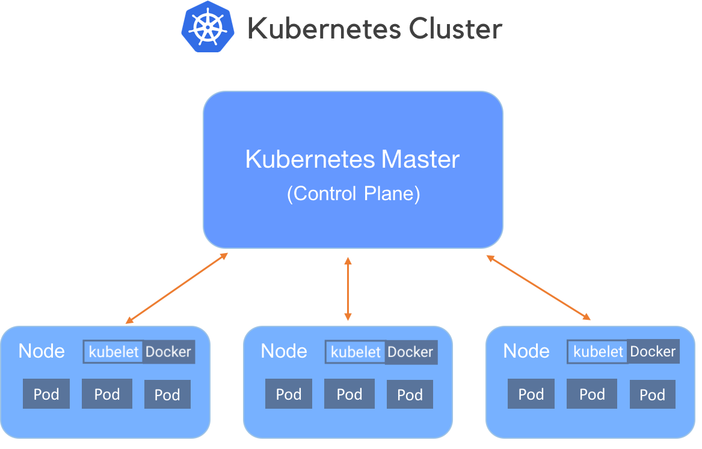

# Container orchestration

**Requirements for Container-Based applications:**

- to manage containers
- to ensure that there is no downtime (SLA requirement)
  
**Container orchestration tools provide:**

- deployment
- management
- scaling
- networking

## Containers complexity

- Provisioning and deployment
- Configuration and scheduling 
- Resource allocation
- Container availability 
- Scaling or removing containers based on balancing workloads across your infrastructure
- Load balancing and traffic routing 
- Monitoring container health
- Configuring applications based on the container in which they will run
- Keeping interactions between containers secure

## Container orchestration tools

- **Kubernetes**
- Docker Compose (has limited functionality)
- Docker Swarm
- Apache Mesos

## Kubernetes 

**Kubernetes** - an open-source system for automating deployment, scaling, and management of containerized applications.

**Provides:**

- Automated rollouts and roll backs
- Service health monitoring
- Automatic scaling of services
- Declarative management
- Deploy anywhere, including hybrid deployments
- Storage orchestration

## Kubernetes cluster

Consists of:

- **Master** - coordinates the cluster
- **Nodes** - workers that run applications



## Kubernetes objects

**Kubernetes objects** - persistent entities in the Kubernetes system. Kubernetes uses these entities to represent the state of the cluster:

- Running containers
- Available resources
- Policies

**Objects:**

- Pod
- Deployment
- Service
- ...

## Kubernetes object management

| Management technique             | Operates on          |Recommended environment |
|----------------------------------|----------------------|------------------------|
| Imperative commands              | Live objects         | Development projects   |
| Imperative object configuration  | Individual files     | Production projects    |
| Declarative object configuration | Directories of files | Production projects    |

**Examples:**

Imperative commands:
```
kubectl create deployment nginx --image nginx
```

Imperative object configuration:

```
kubectl create -f nginx.yaml
kubectl delete -f nginx.yaml -f redis.yaml
```

Declarative object configuration:
```
kubectl diff -f configs/
kubectl apply -f configs/
```

[Read more](https://kubernetes.io/docs/concepts/overview/working-with-objects/object-management/)

## Kubernetes object

Each object contains 2 nested objects:

- `spec` - description of the object, **desired state**
- `status` - **current state**

Example of `.yaml` (or `.yml`) file:

```
apiVersion: v1
kind: Pod
metadata:
  name: redis
spec:
  containers:
  - name: redis
    image: redis
    volumeMounts:
    - name: redis-storage
      mountPath: /data/redis
  volumes:
  - name: redis-storage
    emptyDir: {}
```

[Read more](https://kubernetes.io/docs/concepts/overview/working-with-objects/kubernetes-objects/)

## Pods

**Pods** are:

- the smallest deployable units of computing
- group of one or more containers (tightly coupled)
- could be *replicated* (scaled horizontally)
- ephemeral, disposable entities   
  The Pod remains on the node until the Pod finishes execution, the Pod object is deleted, the Pod is evicted for lack of resources, or the node fails.

`PodTemplate` example:

```
apiVersion: apps/v1
kind: Deployment
metadata:
  name: nginx-deployment
spec:
  selector:
    matchLabels:
      app: nginx
  replicas: 2 # tells deployment to run 2 pods matching the template
  template:
    metadata:
      labels:
        app: nginx
    spec:
      containers:
      - name: nginx
        image: nginx:1.14.2
        ports:
        - containerPort: 80
```

[Read more](https://kubernetes.io/docs/concepts/workloads/pods/)

## Storage in Pods

Kubernetes volumes:
- similar to Docker volumes
- samy types supported

Volume types:
- `emptyDir` - ephemeral (exist as long as Pod is running on that Node)
- `hostPath` - mounts a directory from the Node
- ... many of other types


[Read more](https://kubernetes.io/docs/concepts/storage/volumes/)

## Pod networking

**Communications types:**

1. Highly-coupled container-to-container   
  Solved by Pods and `localhost`
2. Pod-to-Pod   
  Pods on a node can communicate with all pods on all nodes
3. Pod-to-Service   
  Covered by Services
4. External-to-Service   
  Covered by Ingress

[Read more](https://kubernetes.io/docs/concepts/cluster-administration/networking/)
